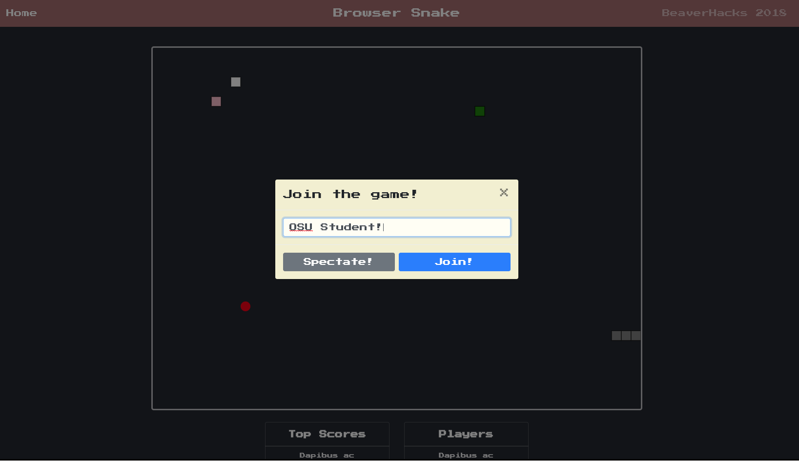

# [browser-snake](https://browser-snake.herokuapp.com/)
Multiplayer web based snake game.  Built for Beaverhacks Fall 2018. 

Built by the crackpot team browser-snake consisting of Brooks Przybylek, Alex Cheng and Matt Britt.

**Description:**

This project is an implementation of the classic Snakes game but allows multiplayer play.  There is a server which runs the game, while each player's client receives game data using websockets.  Gameplay is as follows:
- Use Arrow Keys to move
- To move faster, press the arrow key in the direction you wish to travel
- Eat food pellets to grow your snake
- Colliding with walls and other snakes is acceptable
- Pushing the arrow key in a blocked direction (wall, your snake, other snake) will kill your snake

There is a limit of 8 players at a time

**Todo:**

- Back-End
   - convert to unit-less (everything in terms of snake segment grid) -- no mo pixels on backend **done**
   - timing loop **done**
   - game board class & collision detection **done**
   - grid with which squares are occupied for quick and easy check of collision **done**
   - accept direction changes -- arrow keys (could also add WASD for the lefties out there) **done**
   - 'food' & points & lengthen snake **done**
   - snake grow routine **done**
   - Add user names **done**

- Front-End
   - convert from unit-less (snake segments) to whatever is available for display **done**
   - emit key events **done**
   - handle collisions when server detects them **done**
   - Add user names **done**

 **Future Features**
 
- User accounts
   - store high scores
- additional items
   - poison food
   - food that is poison for some players and points for others
   - pause or stop the snake?
- Beautify
   - logo
